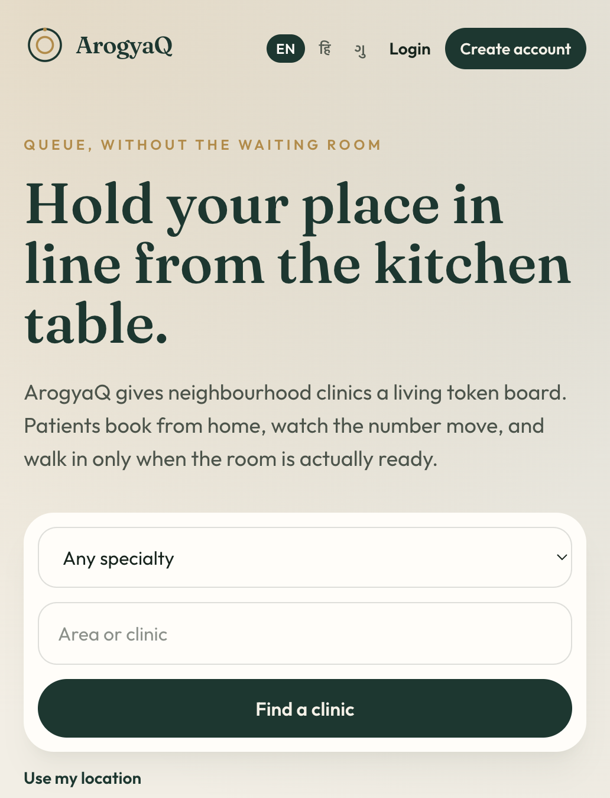
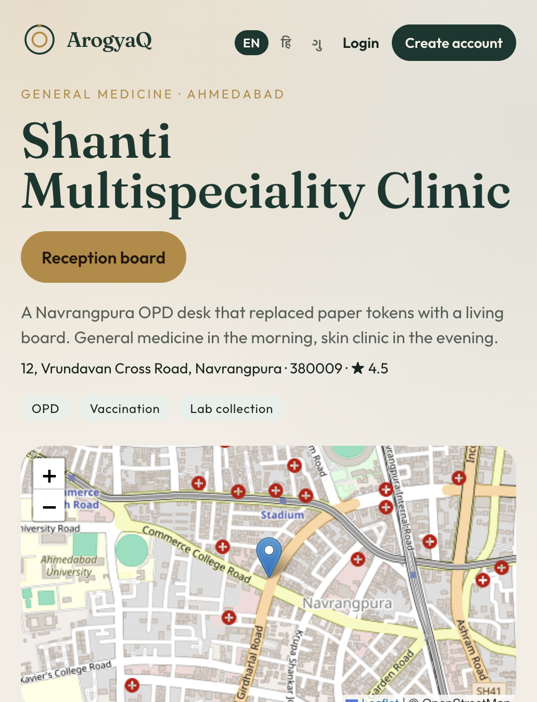
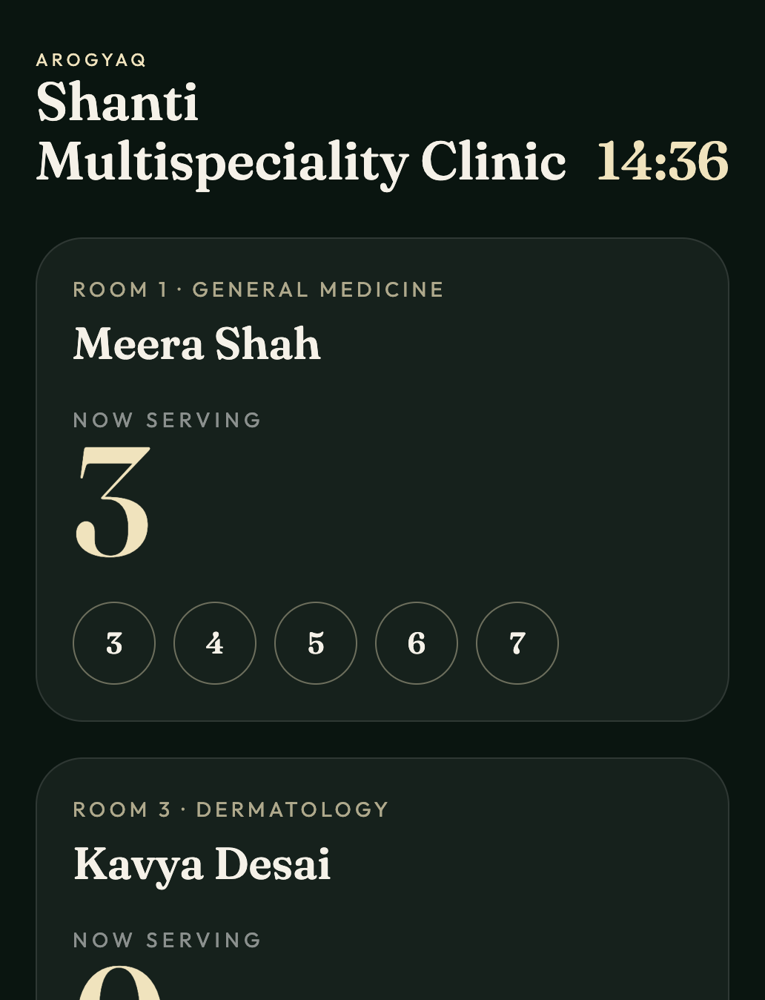
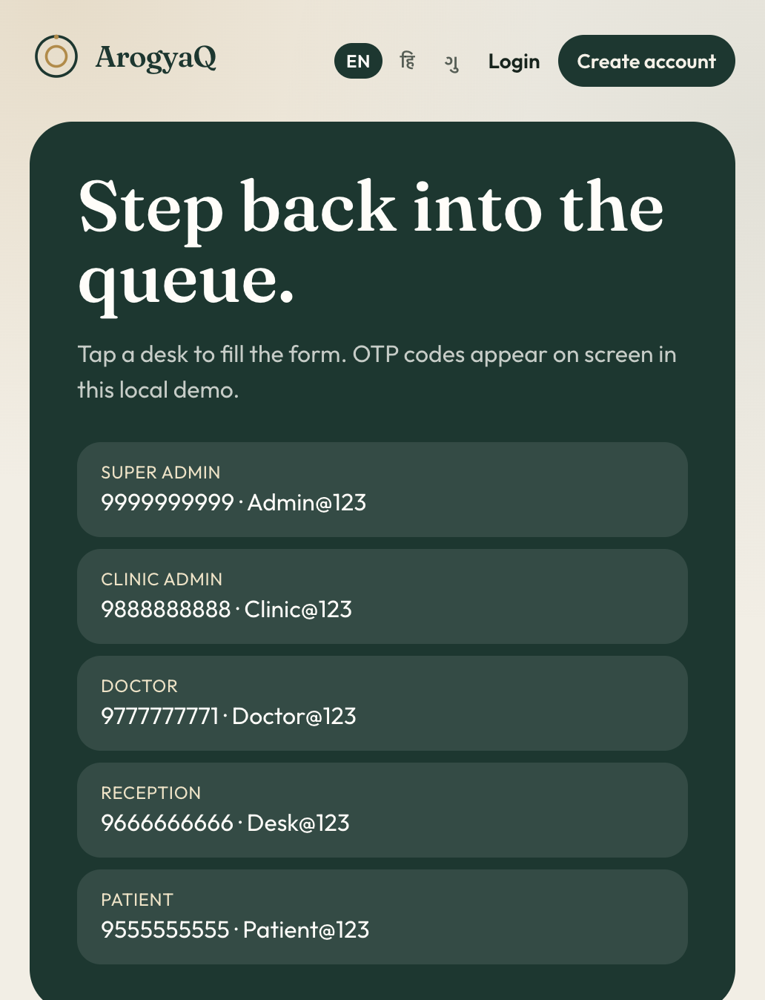

# ArogyaQ

Neighbourhood clinic queue and appointment desk. Patients hold a token from home, watch it move, and walk in when the room is ready.

Laravel 13 runs clinics, doctors, bookings, prescriptions, payments, and reports. A small plain-PHP service in `queue-engine/` keeps the live token board fast enough for a reception PC.

## Screens

<p>
  
  
</p>
<p>
  
  
</p>

## What you need

- PHP 8.3 or newer (8.4 is what this app is built with) and Composer
- Node.js 20 or newer and npm (front-end assets)
- MySQL 8
- For the Docker option: Docker Desktop or Docker Engine with Compose

## Option 1 — Docker

This starts MySQL, Laravel, the queue API, and the WebSocket in one go. Docker MySQL is published on port **3307** so it does not clash with a MySQL already running on 3306.

```bash
docker compose up --build
```

Open [http://localhost:8000](http://localhost:8000).

The first start migrates and seeds demo clinics. Later starts keep the data in the `arogya_mysql` volume.

Stop it:

```bash
docker compose down
```

Wipe the database and start clean:

```bash
docker compose down -v
docker compose up --build
```

Inside the containers the database is `arogya_q`, user `root`, password `Admin@123`, host `mysql`.

## Option 2 — Composer

### 1. Install dependencies

```bash
composer install
npm install
npm run build
```

### 2. Environment

```bash
cp .env.example .env
php artisan key:generate
```

Create the database, then set these values in `.env`:

```env
DB_CONNECTION=mysql
DB_HOST=127.0.0.1
DB_PORT=3306
DB_DATABASE=arogya_q
DB_USERNAME=root
DB_PASSWORD=your-mysql-password
```

```bash
mysql -u root -p -e "CREATE DATABASE IF NOT EXISTS arogya_q CHARACTER SET utf8mb4 COLLATE utf8mb4_unicode_ci;"
```

### 3. Database and storage

```bash
php artisan migrate --seed
php artisan storage:link
```

### 4. Run

Three processes: the site, the queue API, and the live socket.

```bash
bash bin/serve-lan.sh
```

Or start them yourself:

```bash
php artisan serve --host=0.0.0.0 --port=8000
php -S 0.0.0.0:8081 -t queue-engine/public queue-engine/public/index.php
php queue-engine/websocket/server.php
```

Open [http://127.0.0.1:8000](http://127.0.0.1:8000). On a LAN, use this computer’s IP with port 8000.

If `php -v` is older than 8.3, install PHP 8.4 and put it first on your `PATH` before the commands above.

## Demo desks

On a local login page, tap a desk to fill the form. While `OTP_DEMO=true`, OTP codes are shown on screen.

| Desk | Mobile | Password |
|---|---|---|
| Super Admin | 9999999999 | Admin@123 |
| Clinic Admin (Shanti) | 9888888888 | Clinic@123 |
| Doctor (Meera Shah) | 9777777771 | Doctor@123 |
| Reception | 9666666666 | Desk@123 |
| Patient (Riya) | 9555555555 | Patient@123 |

Lotus Dental is waiting for Super Admin approval. Riya’s token today is **#4** at Shanti. The board is serving **#3**, so she is next. The TV board is `/display/shanti-multispeciality`.

## Tests

Tests use an in-memory SQLite database, so they do not touch MySQL.

```bash
php artisan test
```

## Stack

- Laravel 13, PHP 8.4, Sanctum, policies, form requests, events, notifications, scheduler
- Service classes in `app/Services`
- MySQL database `arogya_q`
- English, Hindi, and Gujarati
- SMS and WhatsApp log to the Laravel log until keys are set in `.env`
- Razorpay is skipped until keys are set; the demo pay button marks a visit paid
